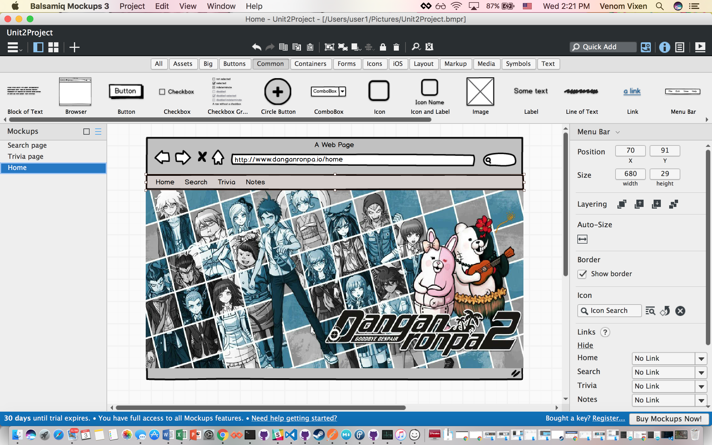
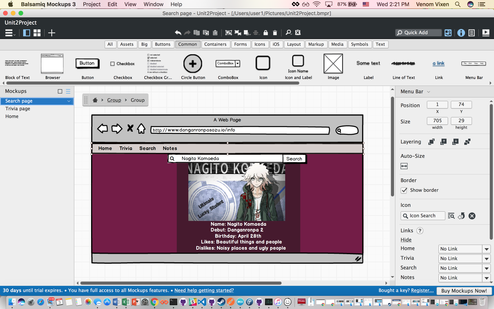
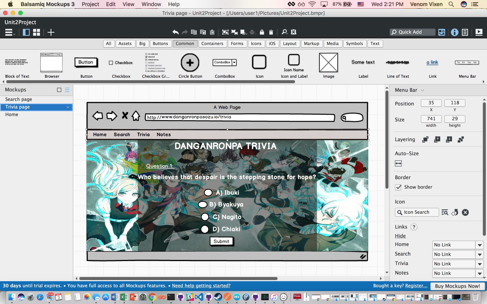
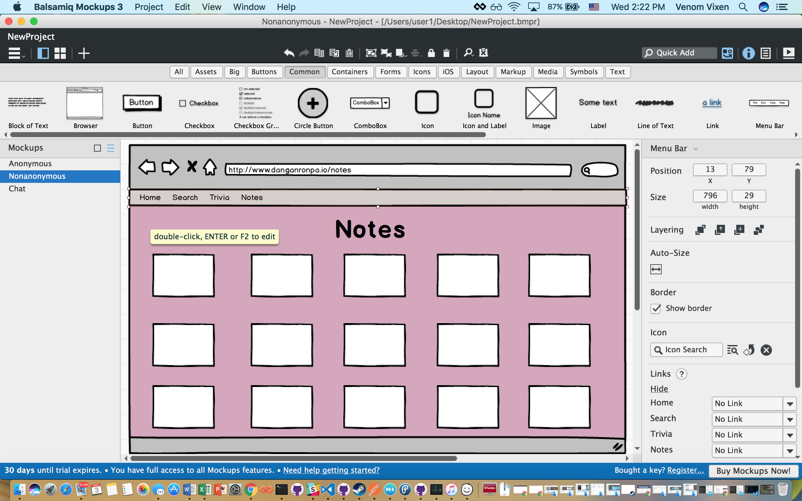

# Danganronpa Source
#### ダンガンロンパ ソース
###### Shauna Walker

#### About
Danganronpa is a series that tells the story of a class of students trapped inside their former school, doing detective work and presenting their evidence; in the vein of Phoenix Wright and Battle Royale.

This web app was made to be the best source for all information on Danganronpa.  

#### User Stories
- As a user, I want a fully functional, finished web app, so that I can have a good user experince
- As a user, I want the web app to be styled and designed well, so that it will be visually appealing and keep my attention
- As a user, I want the web app to be secured, so that I won't worry about my personal information being leaked 

#### Pseudocode 
- Design app that is visually appealing and has good interface for the user
- Make json object that holds data about game information that will be used on the character page
- Use queries so that users can search for specific information in the json object
- Follow CRUD so that users can create, read, update and delete posts
- Allow only logged in users to edit and delete
- Use API that lets users login to web app
- Use queries so that user can search for specific confession information like search by state
- Store all confessions in a database using more than one table
- Link database to server
- Make sure database works after being deployed to heroku
- After MVP: Incorporate socket.io as a framwork to have a live chat room in the app
- After MVP: Use javascript functions and dom mainpulation in order to make a Danganronpa trivia game

#### Wireframes
This is the home page. It will display every character along with their name. Upon clicking a character portrait, the user will be taken to that character's unique id page which will display more information about the character

This is the search page. The user will type a query about Danganronpa. Upon clicking the submit button my web app will loop through the data until it finds that specific query 
 
This is the trivia page. The user will be asked 10 random questions and have answer choices that are linked to radio buttons. After the last question the score will be shown. User will also have option to click modal that will have all the correct answers.
 
This is the notes page. Users will be able to interact with others create, read, update or delete notes that are about the danganronpa series. Notes will be seperated by category.
 

[Link to Trello](https://trello.com/b/J0qGqmYl/project-2-danganronpa)

